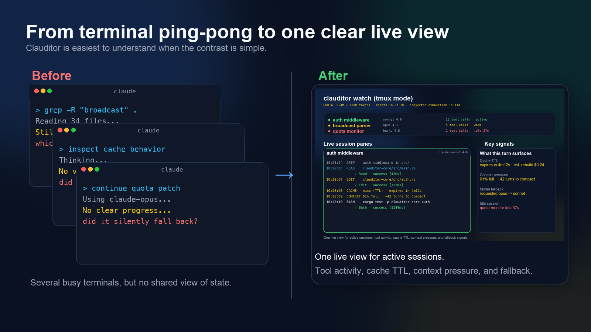
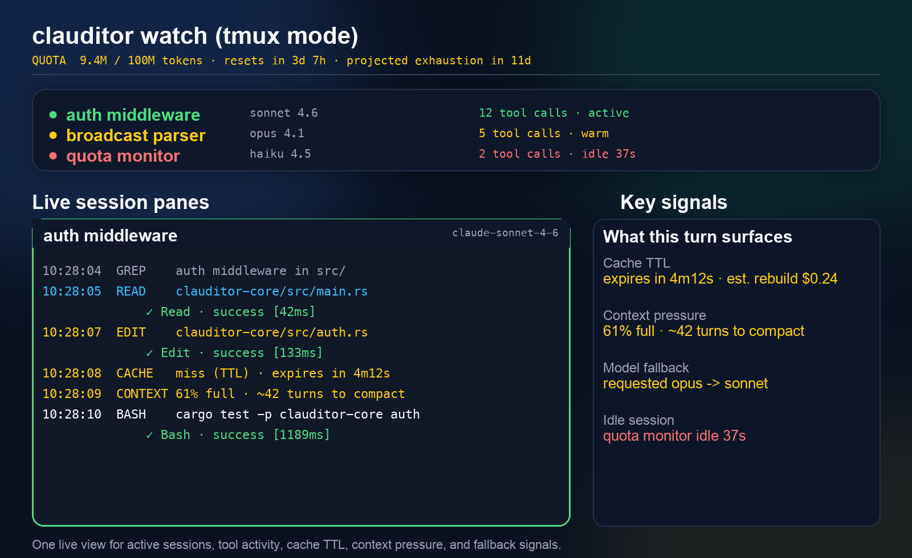

# Clauditor

**Watch your Claude Code sessions without losing the thread.**

Clauditor is a local, fail-open observability layer for Claude Code. It turns overlapping Claude sessions into a live tmux dashboard and optional Grafana trends so you can see tool calls, stalls, cache misses, context pressure, and model fallback without bouncing between terminals.

If you usually run one short Claude session at a time and never wonder why it got slow, this is probably overkill. If you run two, three, or five sessions at once and keep asking "which one is stuck?" or "why did that turn get weird?", this is the problem Clauditor solves.



Visual note: `docs/grafana-overview.png` is curated from real local dashboard crops. The tmux and before/after visuals are illustrative previews based on the current UI and should eventually be replaced with live captures. The asset plan lives in [docs/README.md](docs/README.md).

## Why people install this

- **Multi-session chaos.** Several `claude` terminals are active, but you cannot tell which session is reading files, running tools, or stalling.
- **Slow turns with no explanation.** Cache expiry, fallback, context pressure, and tool failure streaks all look like "Claude is being weird" unless you can see them.
- **No good post-mortem.** You want to remember what a session was about and why it degraded, without storing full transcripts.

## What you get in the first minute

- **Live session watch.** One tmux pane per active session, with tool events and activity state.
- **Debugging signals.** Cache TTL, context fill, projected compaction pressure, silent model fallback, and session diagnosis.
- **History and recall.** Recent sessions, cleaned first prompt, compact final summary, and JSON APIs.

## Trust and boundaries

- **Local proxy.** Claude Code points at local Envoy; Envoy forwards to Anthropic.
- **Loopback-only by default.** Docker Compose publishes the UI and API ports on `127.0.0.1` so the stack stays local to the host unless you intentionally change it.
- **Fail-open.** If `clauditor-core` dies, Envoy still routes traffic to Anthropic.
- **Streaming view.** Response parsing stays off the hot path; live watch is built on streamed SSE.
- **No full transcript storage.** Clauditor stores the cleaned first prompt plus a compact summary of the final assistant response for recall. It does not persist full conversation transcripts, file contents, or raw tool payloads.
- **Estimates stay labeled.** Cost, compaction runway, and parts of diagnosis are estimates or heuristics, not ground truth.

## Quick start

### 1. Build the CLI

```bash
cargo build --release -p clauditor-cli
# Optional: put `clauditor` on your PATH
install -m 0755 target/release/clauditor ~/.local/bin/clauditor
```

### 2. Start the local stack

```bash
docker compose up -d
curl -s http://127.0.0.1:9091/health
# -> ok
```

This starts Envoy, `clauditor-core`, Prometheus, and Grafana. You can ignore Grafana at first and still get value immediately from `clauditor watch`.
By default, the published ports are bound to `127.0.0.1` only.

### 3. Point Claude Code at the proxy

```bash
export ANTHROPIC_BASE_URL=http://127.0.0.1:10000
```

Put that in `~/.zshrc` or `~/.bashrc` if you want every shell to inherit it.

### 4. Open the live dashboard

```bash
clauditor watch --tmux --url http://127.0.0.1:9091
```

If you are not already inside tmux, Clauditor bootstraps a session for you. Detach with `Ctrl+b d`, reattach later with `tmux attach -t clauditor-<pid>`.

### 5. Run `claude` like you normally do

Each active session gets its own pane. You can keep working in your normal terminals while Clauditor shows which session is busy, what tools it used, whether cache just expired, and whether context pressure is building.

Optional trend view:

- Grafana: [http://127.0.0.1:3000](http://127.0.0.1:3000)
- Anonymous viewer mode is enabled
- Admin login is also provisioned as `admin` / `admin`

## What it looks like

**Live tmux view**



**Grafana trend view**


## Core workflows

**Watch all active sessions in plain text**

```bash
clauditor watch --url http://127.0.0.1:9091
```

**Watch one session**

```bash
clauditor watch --session session_1776... --url http://127.0.0.1:9091
```

If you subscribe after the session started, Clauditor injects a synthetic `SessionStart` so you still get the session header and cleaned initial prompt.

**Review recent sessions**

```bash
clauditor sessions --limit 20 --days 7
curl -s http://127.0.0.1:9091/api/sessions?limit=5
curl -s http://127.0.0.1:9091/api/summary
curl -s http://127.0.0.1:9091/api/diagnosis/<session_id>
```

**Recall where you left off**

```bash
clauditor recall "auth middleware"
```

This searches the cleaned first prompt plus a compact summary of the final assistant response for each past session.

**Inspect Prometheus metrics**

```bash
curl -s http://127.0.0.1:9091/metrics | grep '^clauditor_'
```

## What Clauditor surfaces

- **Tool activity.** Reads, edits, bash commands, grep/glob calls, and tool failures.
- **Cache intelligence.** Cache hits, misses, expiry countdown, and estimated rebuild cost.
- **Context pressure.** Fill percentage and projected turns-to-compact as a heuristic.
- **Model fallback.** Detects when the response model differs from the requested model.
- **Quota burn.** Weekly token use, reset time, and projected exhaustion if you set a budget.
- **Session diagnosis.** Post-session hints for slowdown causes like cache expiry, thrash, tool failure streaks, or compaction pressure.
- **Session history.** Recent sessions in SQLite plus lightweight recall.

## Who this is for

- **Claude Code power users** running multiple sessions at once.
- **Developers debugging slow or confusing sessions.**
- **Team leads and heavy daily users** who want visibility into tool use and session health.
- **API-key users** who also care about estimated cost and budget guardrails.

If your main need is token accounting and nothing else, Clauditor is probably more observability stack than you need.

## Advanced features

<details>
<summary>Estimated cost, pricing catalogs, and budget guardrails</summary>

Most Claude Code users are on subscription plans, so this is not the primary reason to install Clauditor. If you run API keys directly, or you want advisory spend estimates, these features are available.

Use a contract pricebook:

```bash
cat > /tmp/clauditor-pricing.toml <<'TOML'
source_label = "contract_2026q2"
trusted_for_budget_enforcement = true

[family.sonnet]
input = 2.10
output = 10.50
cache_read = 0.21
cache_create = 2.63

[family.opus]
input = 12.00
output = 60.00
cache_read = 1.20
cache_create = 15.00
TOML

export CLAUDITOR_PRICING_FILE=/tmp/clauditor-pricing.toml
docker compose up -d
```

Import billed truth for a session:

```bash
clauditor reconcile \
  --session session_1776... \
  --billed-cost 4.63 \
  --source invoice_2026q2
```

Without a trusted pricing file, dollar figures stay advisory and token budgets remain the only hard stop.
</details>

<details>
<summary>Quota burn and session tuning</summary>

Unlock projected quota exhaustion:

```bash
export CLAUDITOR_WEEKLY_TOKEN_BUDGET=100000000
docker compose up -d
```

Tune how quickly idle work splits into a new session:

```bash
CLAUDITOR_SESSION_TIMEOUT_MINUTES=15 docker compose up -d
```
</details>

## How it works

Clauditor sits between Claude Code and Anthropic through local Envoy. Envoy forwards request and streamed response metadata to `clauditor-core`, which parses SSE, tracks sessions, writes SQLite history, serves `/watch`, and exposes `/metrics`.

The key design choice is that response-side parsing returns `CONTINUE` immediately and the ext_proc filter runs with `failure_mode_allow: true`, so observability stays off the hot path and never becomes a hard dependency for Claude traffic.

```text
Claude Code  (ANTHROPIC_BASE_URL=http://127.0.0.1:10000)
    |
    v
+---------------------------------------------+
| Envoy :10000                                |
|   +-- ext_proc --> clauditor-core :50051    |
|   +-- router   --> api.anthropic.com :443   |
+---------------------------------------------+
                    |
                    v
          +---------------------------+
          | clauditor-core            |
          | Rust + tonic + axum       |
          | SSE parser                |
          | watch broadcaster         |
          | diagnosis + SQLite        |
          | HTTP API + /metrics       |
          +---------------------------+
                    ^
                    |
          clauditor watch / Grafana
```

## What it will not do

- **It does not store full transcripts.** Recall persists the cleaned first prompt plus a compact summary of the final assistant response, not every turn.
- **It does not guarantee correctness.** "Likely completed", diagnosis labels, compaction runway, and similar signals are heuristics.
- **It does not show perfect live dollar truth.** Cost is estimated unless reconciled with billed data.
- **It does not make Claude faster by itself.** It helps you see why a session is slow and where time is going.
- **It is not a hosted service.** You run the proxy and dashboards locally.

## Developing on it

```bash
docker compose up -d --build
docker compose logs -f clauditor-core
./test/parallel-sessions.sh 4
bash test/e2e.sh
cargo fmt && cargo clippy -- -W clippy::all
```

Before touching the request path or broadcast path, read [CONTRIBUTING.md](CONTRIBUTING.md). That is the public contributor guide and includes the load-bearing invariants.
