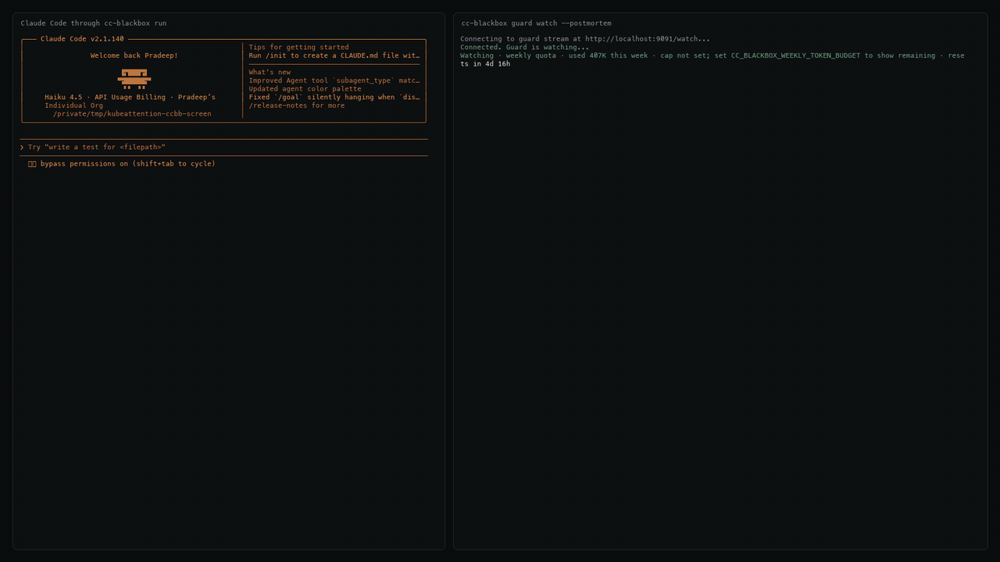
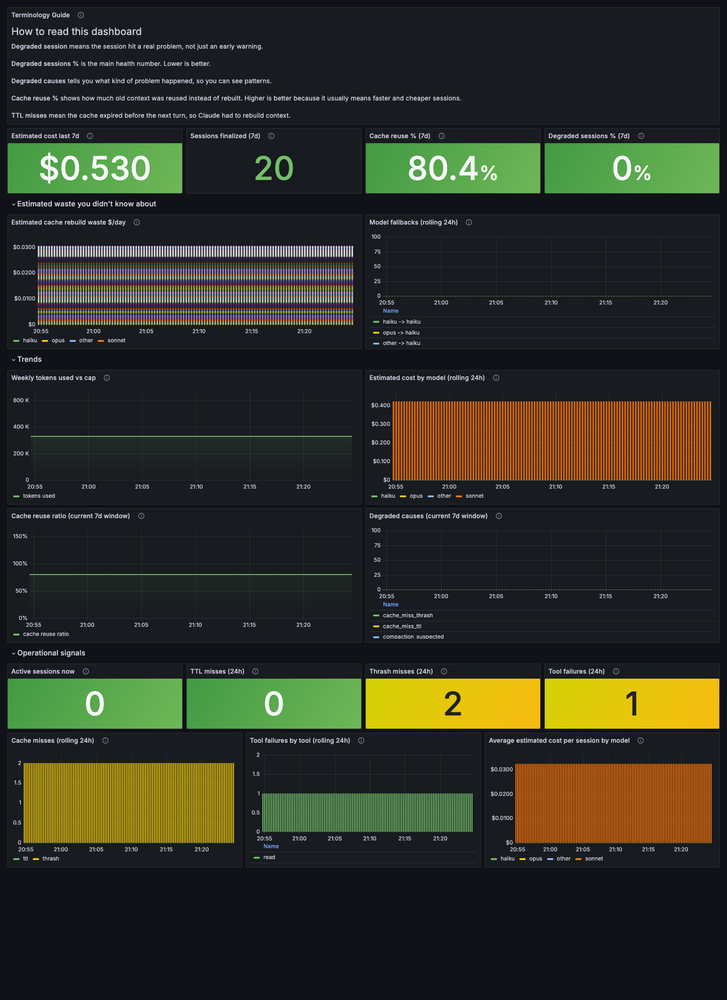

# Clauditor

**A local way to keep an eye on Claude Code when things get busy.**

Clauditor is a local, fail-open observability layer for Claude Code. In plain English: it sits between Claude Code and Anthropic, watches the request and response flow, and gives you a better picture of what each session is doing.

I made this because once I had a few `claude` terminals open at the same time, I kept losing track of them. One would be chewing through tools, another would be idle, another would suddenly get slower, and I had no quick way to tell why. Clauditor is meant to make that less annoying.

If you only run one short Claude session now and then, the full stack is probably more setup than you need. If you run longer sessions, care about cost or context trends, or regularly have multiple sessions open and keep wondering which one is stuck or why a turn got weird, this is where it starts to pay off.



## Why people install this

- **Multi-session mess.** You have several `claude` terminals open and no clear sense of which one is active, blocked, or drifting.
- **Slow turns with no obvious cause.** Cache expiry, model fallback, tool churn, and context pressure all feel the same from the outside unless you can actually see them.
- **A Grafana dashboard for trends.** Sometimes you do not want just the live tmux view, you want the Grafana dashboard to look at session and cost trends over time.
- **Bad memory after the fact.** You want some lightweight recall about what a session was doing without saving the whole transcript.

## What you get in the first minute

- **A live session view.** One tmux pane per active session, with activity state and recent events.
- **A Grafana trend view.** A dashboard for session, quality, and estimated cost trends over time.
- **Useful debug signals.** Cache TTL, context fill, turns-to-compact, fallback detection, and session diagnosis.
- **Simple history.** Recent sessions, cleaned first prompt, compact final summary, and JSON APIs if you want to script around it.

## Trust and boundaries

- **Local proxy.** Claude Code points at local Envoy, and Envoy forwards to Anthropic.
- **Loopback-only by default.** Docker Compose publishes the host ports on `127.0.0.1`, so the stack stays local to the machine unless you change it yourself.
- **Fail-open behavior.** If `clauditor-core` dies, Envoy still routes traffic onward.
- **Streaming, not buffering.** The live watch view is based on streamed SSE parsing, so you see events as they happen.
- **No full transcript storage.** Clauditor stores a cleaned first prompt and a compact final summary for recall. It does not persist full conversation history, raw file contents, or raw tool payloads.
- **Some values are estimates.** Cost, compaction runway, and parts of diagnosis are heuristics. They are there to help you reason, not to pretend they are perfect truth.

## Quick start

### 1. Build the CLI

```bash
cargo build --release -p clauditor-cli
# Optional: put `clauditor` on your PATH
install -m 0755 target/release/clauditor ~/.local/bin/clauditor
```

### 2. Start the local stack

```bash
docker compose up -d
curl -s http://127.0.0.1:9091/health
# -> ok
```

This brings up Envoy, `clauditor-core`, Prometheus, and Grafana. You can ignore Grafana at first and still get most of the value from `clauditor watch`.

By default the published ports are bound to `127.0.0.1` only.

### 3. Point Claude Code at the proxy

```bash
export ANTHROPIC_BASE_URL=http://127.0.0.1:10000
```

If you want this on every shell, drop it into your shell startup file.

### 4. Open the live dashboard

```bash
clauditor watch --tmux --url http://127.0.0.1:9091
```

If you are not already inside tmux, Clauditor will bootstrap a tmux session for you. Detach with `Ctrl+b d`, and reattach later with `tmux attach -t clauditor-<pid>`.

If you want the Grafana dashboard, open this directly in your browser:

- Dashboard: [http://127.0.0.1:3000/d/clauditor-main](http://127.0.0.1:3000/d/clauditor-main)

### 5. Run `claude` like you normally do

That is basically it. Work as usual, and Clauditor will show which session is active, which tools ran, whether cache expired, whether context is filling up, and whether a request silently fell back to another model.

Optional trend view:

- Grafana dashboard: [http://127.0.0.1:3000/d/clauditor-main](http://127.0.0.1:3000/d/clauditor-main)
- Anonymous viewer mode is enabled
- Admin login is also provisioned as `admin` / `admin`

## What it looks like

**Live tmux view**

The live tmux view is shown in the demo above.

**Grafana trend view**



## Core workflows

**Watch all active sessions in plain text**

```bash
clauditor watch --url http://127.0.0.1:9091
```

**Watch one session**

```bash
clauditor watch --session session_1776... --url http://127.0.0.1:9091
```

Replace `session_1776...` with a real session id from `/api/sessions`. If you subscribe after a session already started, Clauditor injects a synthetic `SessionStart` so the watcher still gets the session header and cleaned initial prompt.

**Review recent sessions**

```bash
clauditor sessions --limit 20 --days 7
curl -s 'http://127.0.0.1:9091/api/sessions?limit=5'
curl -s http://127.0.0.1:9091/api/summary
curl -s http://127.0.0.1:9091/api/diagnosis/<session_id>
```

**Recall where you left off**

```bash
clauditor recall "auth middleware"
```

This searches the cleaned first prompt and the compact final summary for each stored session.

**Inspect Prometheus metrics**

```bash
curl -s http://127.0.0.1:9091/metrics | grep '^clauditor_'
```

## What Clauditor surfaces

- **Tool activity.** Reads, edits, bash commands, grep/glob calls, and tool failures.
- **Cache intelligence.** Cache hits, misses, expiry countdown, and estimated rebuild cost.
- **Context pressure.** Fill percentage and projected turns-to-compact as a heuristic.
  Fill percentage is computed against the detected context window for the current request, including extended-context requests such as `sonnet[1m]` or `opus[1m]`.
- **Model fallback.** Detection when the response model differs from the requested one.
- **Quota burn.** Weekly token use, reset time, and projected exhaustion if you set a budget.
- **Session diagnosis.** Post-session hints for things like cache expiry, thrash, tool failure streaks, or compaction pressure.
- **Session history.** Recent sessions in SQLite plus lightweight recall.

If your provider or gateway strips the signal Clauditor uses to detect extended context, pin the denominator explicitly:

```bash
CLAUDITOR_CONTEXT_WINDOW_TOKENS=1000000 docker compose up -d
```

## Who this is for

- **Claude Code power users** who run multiple sessions at once.
- **Developers debugging slow or confusing sessions.**
- **People who want a little observability** without standing up a whole seperate system.
- **API-key users** who care about estimated cost and budget guardrails on top of the usual session tracking.

If your only goal is token accounting, Clauditor is probably more stack than you need.

## How it works

Clauditor sits between Claude Code and Anthropic through local Envoy. Envoy forwards request and streamed response metadata to `clauditor-core`, which parses SSE, tracks sessions, writes SQLite history, serves `/watch`, and exposes `/metrics`.

The important design choice is that response-side parsing returns `CONTINUE` immediately and the ext_proc filter runs with `failure_mode_allow: true`. That keeps observability off the hot path and avoids turning the proxy into a hard dependency.

```text
Claude Code  (ANTHROPIC_BASE_URL=http://127.0.0.1:10000)
    |
    v
+---------------------------------------------+
| Envoy :10000                                |
|   +-- ext_proc --> clauditor-core :50051    |
|   +-- router   --> api.anthropic.com :443   |
+---------------------------------------------+
                    |
                    v
          +---------------------------+
          | clauditor-core            |
          | Rust + tonic + axum       |
          | SSE parser                |
          | watch broadcaster         |
          | diagnosis + SQLite        |
          | HTTP API + /metrics       |
          +---------------------------+
                    ^
                    |
          clauditor watch / Grafana
```

## Developing on it

```bash
docker compose up -d --build
docker compose logs -f clauditor-core
bash test/e2e.sh
bash test/parallel-sessions.sh 4
cargo fmt
cargo clippy -- -W clippy::all
```

Before touching the request path or the broadcast path, read [CONTRIBUTING.md](CONTRIBUTING.md). That guide has the public invariants and the parts that are easy to break by accident.
