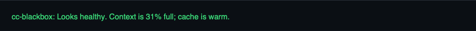
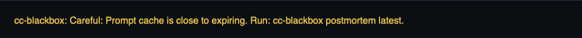
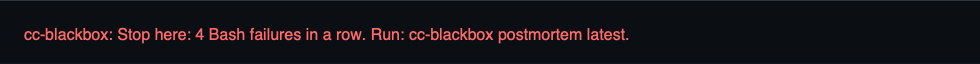

# cc-blackbox

Claude Code can look busy even when the useful work has already stopped.

cc-blackbox adds a one-line footer to Claude Code. It tells you whether the current session looks healthy, needs care, should stop, is blocked, is cooling down, or has ended.

When the footer says the run needs a closer look, use `cc-blackbox postmortem latest`. The footer gives you the short answer. The postmortem gives you the evidence and a restart prompt.

## Start Here

Install cc-blackbox:

```bash
curl -fsSL https://raw.githubusercontent.com/softcane/cc-blackbox/main/install.sh | sh
```

Run Claude Code through cc-blackbox:

```bash
cc-blackbox run claude
```

While Claude is running, read the footer at the bottom of Claude Code. It updates as cc-blackbox sees traffic, failed tools, cache behavior, context pressure, API errors, and policy blocks.

The footer looks like this in normal, careful, and stop cases:







When the footer says to review the run, or after you stop a session that felt stuck, read the latest postmortem:

```bash
cc-blackbox postmortem latest
```

`cc-blackbox run claude` starts the local stack if needed, then launches Claude Code through the local proxy. It also installs the cc-blackbox footer when Claude does not already have a custom status line.

If you want a separate terminal view, run:

```bash
cc-blackbox guard watch
```

That is optional. The footer is the normal live view.

## What It Does

- **Shows the live state:** healthy, careful, stop, blocked, cooldown, or ended.
- **Tells you the main reason:** cache rebuilds, context pressure, failed tools, API errors, budget limits, or model route mismatch.
- **Gives the next move:** continue, narrow the next prompt, stop and fix something, wait, or open the postmortem.
- **Explains bad runs:** token totals, cache behavior, estimated spend, failed tools, and likely wasted work.
- **Helps you restart:** a compact restart prompt for the next Claude Code session.
- **Stays local:** derived metadata stays on your machine.

cc-blackbox runs locally. Claude Code traffic still goes to Anthropic. cc-blackbox stores derived metadata, not raw full transcripts or file contents. Optional postmortem analysis sends only redacted evidence to Claude, and you can turn that off.

## When This Saves You

- Claude keeps retrying broken commands.
- Claude burns tokens near compaction.
- Claude looks busy but never reaches a clear answer.
- Claude validates against missing local state, fake infrastructure, or the wrong environment.
- You want a restart prompt instead of continuing a bloated session.

## Real Example

Here is the failure mode cc-blackbox is built for: Claude looked active, but the run had already stopped being useful.

In one read-only validation run, Claude moved through a checklist, read docs, ran tests, tried `kubectl`, and rendered Helm YAML. From the terminal, that looked like progress. The postmortem showed the real story:

- 15 assistant turns in 31 seconds.
- 321K total tokens, including 299K cache-read tokens.
- 6 failed Bash tool results.
- Tests could not prove the change because `go.sum` data was missing in a nested scheduler module.
- Cluster checks were hitting `localhost:8080`; no real cluster was attached.
- Claude never reached a final ship/no-ship verdict.


The useful move was not "let it keep trying." The useful move was: **stop this session, fix the module boundary and `go.sum`, attach a real cluster, then rerun validation.**

For live runs, the footer is where that warning should show up before you spend another prompt.

## Live Footer

The footer is what you normally read while Claude is running. It is short on purpose.

Healthy:

```text
cc-blackbox: Looks healthy. Context is 31% full; cache is warm.
```

Careful:

```text
cc-blackbox: Careful: Prompt cache is close to expiring. Run: cc-blackbox postmortem latest.
```

Stop:

```text
cc-blackbox: Stop here: 4 Bash failures in a row. Run: cc-blackbox postmortem latest.
```

Blocked:

```text
cc-blackbox: Blocked: The session token budget was exceeded. Start narrower or adjust the policy.
```

Use the footer this way:

- `Looks healthy`: keep going.
- `Careful`: keep the next prompt narrow.
- `Stop here`: fix the main issue before retrying.
- `Blocked`: cc-blackbox stopped a request because policy said to.
- `Cooldown`: wait before retrying.
- `Session ended`: read the postmortem if you need the details.

The footer answers: **can I keep going, and why?**

The postmortem answers: **what happened, what proves it, and how should I restart?**

## Live Guard

Live Guard is the lower-level view behind the footer. Use it when you want to inspect all sessions, policy state, or the event stream in a separate terminal.

```bash
cc-blackbox guard start     # start or validate the local guard stack
cc-blackbox guard policy    # show the effective policy and config source
cc-blackbox guard status    # show current sessions and guard state
cc-blackbox guard watch     # stream live findings in plain language
```

The states are: `Healthy`, `Watching`, `Warning`, `Critical`, `Blocked`, `Cooldown`, and `Ended`.
A warning means "pay attention." Critical means "stop and inspect." Blocked and Cooldown mean cc-blackbox returned a policy response instead of forwarding that request.

Guard findings are evidence-labeled. A model mismatch is reported as a route mismatch. Context runway and compaction risk are marked as heuristics. Tool and JSONL findings say where the evidence came from.

## Postmortem

The footer tells you what to do now. The postmortem tells you what happened.

Postmortems are redacted by default. They combine cc-blackbox data with local Claude Code JSONL when a confident match exists. Without a confident JSONL match, cc-blackbox produces a local-only report instead of mixing sessions.

```markdown
# cc-blackbox Postmortem

## Snapshot
  Session       `session_1776_abcd`
  State         final postmortem
  Outcome       Degraded
  Model         claude-sonnet-4-6
  Duration      18m
  Turns/tokens  7 turns, 214K
  Cost          $4.91

## Signals
  Cause    Repeated cache rebuilds [heuristic]
  Cache    Low: 42% reusable prompt cache; 36% of input from cache
  Context  High: 87% full; about 1 turn before auto-compaction
  Waste    Likely waste: 76K tokens, $1.84
  Tools    14 calls, 0 failures; repeated: Read, Edit
  Skills   No failed skill events detected
  MCP      No failed MCP calls detected
  Next     Restart with a shorter prompt and inspect the repeated Read/Edit path first.

## Evidence
  Type        Signal        Turn   Detail
  ----------  ------------  -----  ------
  direct      cache         6      cache miss followed by 62K cache creation tokens
  direct      tools         7      14 Read/Edit calls against the same redacted path

## Analysis
  What happened  The session got stuck in repeated Read/Edit work after a cache rebuild.
  What it means  The direct tool loop is enough to act; the context estimate is heuristic.
  What to do     Restart with the summary and ask for one file-level change at a time.

## Restart Prompt
  Continue from this summary. Make one file-level change at a time, and inspect the repeated Read/Edit path before editing.
```

Model-assisted analysis is on by default. It sends only the redacted postmortem JSON to Claude. For deterministic local output without that extra analysis call, run:

```bash
cc-blackbox postmortem latest --no-analyze-with-claude
```

`cc-blackbox postmortem last` is also accepted.

## Advanced Policy

cc-blackbox fails open by default. If policy cannot load, a detector fails, or the guard is unhealthy, traffic is allowed rather than making cc-blackbox a hard dependency.

By default, request blocking is conservative:

| Signal | Default action | Stops next request? | Policy key |
| --- | --- | --- | --- |
| Session token budget | Block when a token limit is set | Yes | `per_session_token_budget_exceeded` |
| Trusted session dollar budget | Block when a trusted dollar limit is set | Yes | `per_session_trusted_dollar_budget_exceeded` |
| API error streak | Cooldown | Yes | `api_error_circuit_breaker_cooldown` |
| Repeated cache rebuilds | Warn | No | `repeated_cache_rebuilds` |
| Context pressure / near compaction | Warn | No | `context_near_warning_threshold` |
| Suspected compaction loop | Warn | No | `suspected_compaction_loop` |
| Model route mismatch | Warn | No | `model_mismatch` |
| Tool failure streak | Warn | No | `tool_failure_streak` |
| Weekly/project quota burn | Warn | No | `high_weekly_project_quota_burn` |

Blocking happens on the next request, not by stopping a response already in flight. Response-side analysis updates guard state after the stream continues, and request-side policy enforcement decides whether the next call is forwarded upstream.

Only token budget, trusted dollar budget, and API cooldown stop a request today. The other signals change guard severity and postmortem output; they do not interrupt Claude Code traffic.

For simple budget controls, set limits before starting `cc-blackbox run claude` or `cc-blackbox guard start`:

```bash
export CC_BLACKBOX_SESSION_BUDGET_TOKENS=1000000
export CC_BLACKBOX_SESSION_BUDGET_DOLLARS=5
export CC_BLACKBOX_CIRCUIT_BREAKER_THRESHOLD=5
export CC_BLACKBOX_CIRCUIT_BREAKER_COOLDOWN_SECS=30
cc-blackbox guard start
```

Token budgets are straightforward hard stops. Dollar budgets only hard-stop when the active pricing source is trusted for enforcement; otherwise they stay visible as estimates.

For a TOML policy file, edit `~/.config/cc-blackbox/guard-policy.toml`.

```bash
mkdir -p ~/.config/cc-blackbox
$EDITOR ~/.config/cc-blackbox/guard-policy.toml
cc-blackbox guard start
cc-blackbox guard policy
```

Starter policy:

```toml
fail_open = true

[rules.per_session_token_budget_exceeded]
action = "block"
limit_tokens = 1000000

[rules.api_error_circuit_breaker_cooldown]
action = "cooldown"
threshold_count = 5
cooldown_secs = 30

[rules.context_near_warning_threshold]
action = "warn"
threshold_count = 90

[rules.repeated_cache_rebuilds]
action = "warn"

[rules.model_mismatch]
action = "warn"
```

This starter policy does three things: blocks a session after 1M tokens, opens a short cooldown after 5 repeated API errors, and leaves the other signals as warnings.

`cc-blackbox guard policy` shows the effective policy, where it was loaded from, and any ignored keys. The core reads the file when policy is checked, so editing the TOML is enough for the next request/status read.

## Why It Is Safe To Run Locally

cc-blackbox is designed to be safe to try because it stays local and is easy to stop using.

- **Local-first:** cc-blackbox runs on your machine, and local services bind to `127.0.0.1` by default.
- **Derived metadata storage:** cc-blackbox stores metrics, session facts, first-message hashes, and derived findings. It does not persist raw prompts, assistant text, tool outputs, file contents, or raw JSONL message text.
- **Fails open:** If cc-blackbox stops or cannot evaluate policy, Claude Code traffic can keep going to Anthropic.
- **Explicit blocks:** block responses come from policy decisions, not hidden guesses.
- **Evidence is labeled:** Costs are estimates unless the pricing source is trusted, context runway is heuristic, and model route mismatch reports observed requested/actual models without claiming provider cause.

## Reference

### Advanced

#### Supporting Workflows

The footer is the normal live view. Live Guard, watch mode, APIs, and Grafana are useful when you want lower-level events or history across many sessions.

- **Start or validate the guard stack:** `cc-blackbox guard start`
- **Show effective guard policy:** `cc-blackbox guard policy`
- **Show current guard state:** `cc-blackbox guard status`
- **Watch guard findings:** `cc-blackbox guard watch`
- **Read the latest postmortem:** `cc-blackbox postmortem latest`
- **Force local-only postmortem synthesis:** `cc-blackbox postmortem latest --no-analyze-with-claude`
- **Render local unredacted evidence:** `cc-blackbox postmortem latest --no-redact`
- **Watch all active sessions:** `cc-blackbox watch --url http://127.0.0.1:9091`
- **Opt into automatic watch postmortems:** `cc-blackbox watch --postmortem`
- **Watch all sessions in tmux:** `cc-blackbox watch --tmux`
- **Watch one session:** `cc-blackbox watch --session session_1776... --url http://127.0.0.1:9091`
- **Review recent sessions:** `cc-blackbox sessions --limit 20 --days 7`
- **Open the local session API:** `curl -s 'http://127.0.0.1:9091/api/sessions?limit=5'`
- **Read the current local summary:** `curl -s http://127.0.0.1:9091/api/summary`
- **Inspect one session diagnosis:** `curl -s http://127.0.0.1:9091/api/diagnosis/<session_id>`
- **Advanced hook setup:** [Claude Code hook telemetry](docs/reference/advanced.md#claude-code-hook-telemetry)

Open Grafana at [http://127.0.0.1:3000/d/cc-blackbox-main](http://127.0.0.1:3000/d/cc-blackbox-main) when you want longer-running trends. Anonymous viewer mode is enabled, and the local admin login is `admin` / `admin`.


### Links

- [Advanced setup and architecture](docs/reference/advanced.md)
- [Developing on cc-blackbox](docs/reference/developing.md)
