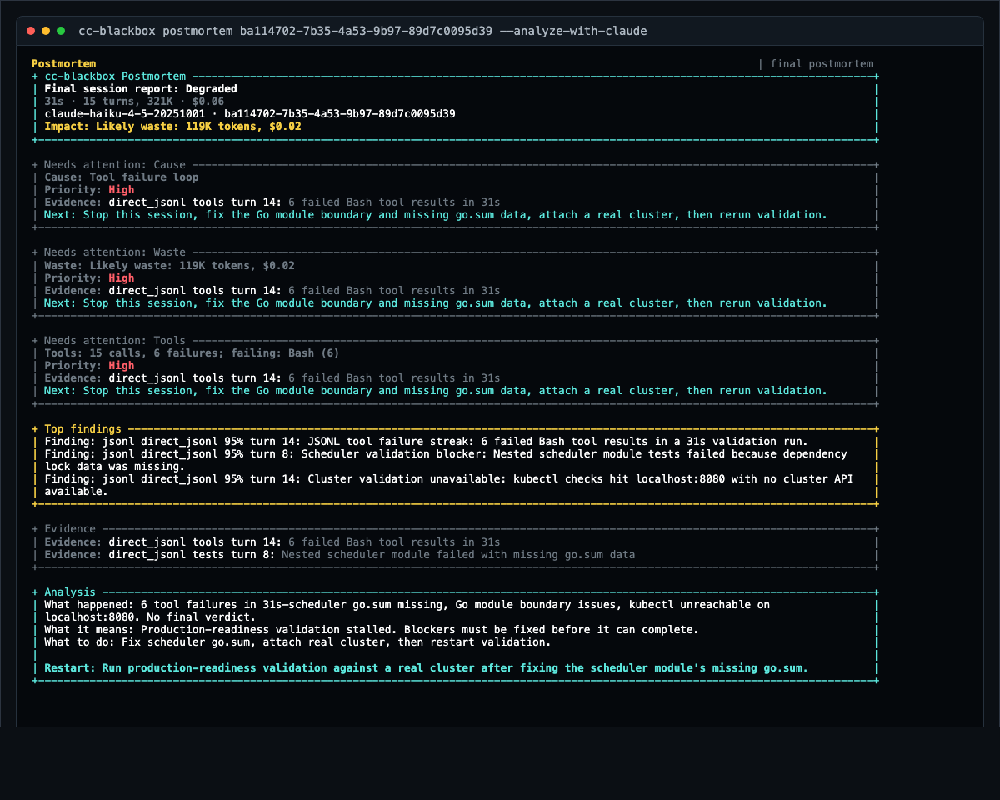

# cc-blackbox

cc-blackbox is a local flight recorder and guardrail for Claude Code. It tells you when a session is wasting tokens, looping on tools, drifting toward compaction, hitting model-route surprises, or should be restarted.

Claude Code failure usually does not look like failure at first. The terminal is still moving. Tools are still running. But the session may already be rebuilding cache every turn, retrying broken commands, or spending tokens on work that should have been restarted ten minutes ago.

cc-blackbox gives you two answers:

- **During the run:** is this session healthy, warning, critical, blocked, cooling down, or ended?
- **After the run:** what happened, what evidence supports it, and what restart prompt should I use?

## Real Example

In a read-only KubeAttention validation run, Claude kept moving through a fixed checklist. The session looked productive from the terminal, but the useful answer was already clear: stop, fix the blockers, then rerun validation.

The postmortem found:

- 15 assistant turns in 31 seconds.
- 321K total tokens, including 299K cache-read tokens.
- 6 failed Bash tool results.
- Missing `go.sum` data in the nested scheduler module.
- `kubectl` checks hitting `localhost:8080` with no real cluster available.
- No final ship/no-ship verdict captured.



This screenshot uses local Claude JSONL evidence from that run. Proxy captures add live guard state and request-side policy checks while the session is still active.

The postmortem gives a concrete next step: **stop this session, fix the module boundary and `go.sum`, attach a real cluster, then rerun validation.**

## What You Get

- **A live guard:** current state, warnings, critical findings, blocks, cooldowns, and policy source.
- **A plain watch stream:** tool use, cache state, context pressure, model route mismatch, quota burn, and session lifecycle.
- **A redacted postmortem:** likely cause, direct/proxy/JSONL/heuristic evidence, token/cost impact, and next action.
- **A restart prompt:** a compact prompt for a fresh Claude Code session when continuing is no longer the right move.
- **Local-first storage:** derived metadata in local SQLite; no hosted cc-blackbox telemetry service.

cc-blackbox runs Claude Code through a local proxy so it can watch the API stream while the session is still alive. The proxy, database, metrics, dashboard, and CLI run on your machine. Claude Code API traffic is proxied to Anthropic. Optional postmortem analysis asks Claude to read redacted evidence unless you disable that step.

## Quick Start

Install cc-blackbox:

```bash
curl -fsSL https://raw.githubusercontent.com/softcane/cc-blackbox/main/install.sh | sh
```

Start the local guard stack:

```bash
cc-blackbox doctor
cc-blackbox guard start
cc-blackbox guard policy
```

Run Claude Code through the proxy:

```bash
cc-blackbox run claude
```

In another terminal, watch the guard state. Add `--watch` to `cc-blackbox run` only if you also want the lower-level event stream next to the Claude process.

```bash
cc-blackbox guard status
cc-blackbox guard watch
```

When the session is over or idle, read the postmortem:

```bash
cc-blackbox postmortem latest
```

## Guard Mode

Guard mode is the day-to-day interface. It is the product-facing view over the existing local stack.

```bash
cc-blackbox guard start     # start or validate the local proxy/core stack
cc-blackbox guard policy    # show the effective policy and config source
cc-blackbox guard status    # show current sessions and guard state
cc-blackbox guard watch     # stream live findings in plain language
```

The states are: `Healthy`, `Watching`, `Warning`, `Critical`, `Blocked`, `Cooldown`, and `Ended`.
A warning means "pay attention." Critical means the next request may be blocked if policy says so. Blocked and Cooldown mean cc-blackbox already returned a policy response instead of forwarding that request.

Guard findings are evidence-labeled. A model mismatch is reported as a route mismatch. Context runway and compaction risk are marked as heuristics. Tool and JSONL findings say where the evidence came from.

## What Can Block

cc-blackbox fails open by default. If policy cannot load, a detector fails, or the guard is unhealthy, traffic is allowed rather than making the proxy a hard dependency.

By default, blocking is conservative:

| Signal | Default action | Can block? | When a request is blocked |
| --- | --- | --- | --- |
| Session token budget | Block | Yes | The next request after the session exceeds `CC_BLACKBOX_SESSION_BUDGET_TOKENS` or the policy token limit. |
| Trusted session dollar budget | Block | Yes | The next request after trusted estimated spend exceeds `CC_BLACKBOX_SESSION_BUDGET_DOLLARS` or the policy dollar limit. |
| API error streak | Cooldown | Yes | Requests during the cooldown window after the configured number of consecutive API errors. |
| Repeated cache rebuilds | Warn | Only if explicitly configured | Not blocked by default. |
| Context pressure / near compaction | Warn | Only if explicitly configured | Not blocked by default. |
| Suspected compaction loop | Warn | Only if explicitly configured | Not blocked by default. |
| Model route mismatch | Warn | Only if explicitly configured | Not blocked by default. |
| Tool failure streak | Warn | Only if explicitly configured | Not blocked by default. |
| Weekly/project quota burn | Warn | No by default | Not blocked by default. |
| No-progress / task abandonment inference | Diagnose only | No by default | Not blocked by default. |
| Missing or ambiguous JSONL | Diagnose only | No | Never blocks live traffic. |

Blocking happens on the next request, not by stopping a response already in flight. Response-side analysis updates guard state after the stream continues, and request-side policy enforcement decides whether the next call is forwarded upstream.

That split matters. A false warning is annoying. A false block interrupts work. cc-blackbox should only block when the policy is explicit and the signal is strong enough.

For simple budget controls, set limits before starting the guard stack:

```bash
export CC_BLACKBOX_SESSION_BUDGET_TOKENS=1000000
export CC_BLACKBOX_SESSION_BUDGET_DOLLARS=5
export CC_BLACKBOX_CIRCUIT_BREAKER_THRESHOLD=5
export CC_BLACKBOX_CIRCUIT_BREAKER_COOLDOWN_SECS=30
cc-blackbox guard start
```

Token budgets are straightforward hard stops. Dollar budgets only hard-stop when the active pricing source is trusted for enforcement; otherwise they stay visible as estimates.

For a TOML policy file, set `CC_BLACKBOX_GUARD_POLICY_PATH` and check what cc-blackbox loaded with `cc-blackbox guard policy`.

## Postmortem

The guard tells you what is happening now. The postmortem tells you what happened after the session has enough evidence to be useful.

Postmortems are redacted by default. They combine proxy data with local Claude Code JSONL when a confident match exists. If JSONL is missing or ambiguous, cc-blackbox says so and produces a proxy-only report instead of mixing sessions.

```markdown
# cc-blackbox Postmortem

## Snapshot
  Session       `session_1776_abcd`
  State         final postmortem
  Outcome       Degraded
  Model         claude-sonnet-4-6
  Duration      18m
  Turns/tokens  7 turns, 214K
  Cost          $4.91

## Signals
  Cause    Repeated cache rebuilds [heuristic]
  Cache    Low: 42% reusable prompt cache; 36% of input from cache
  Context  High: 87% full; about 1 turn before auto-compaction
  Waste    Likely waste: 76K tokens, $1.84
  Tools    14 calls, 0 failures; repeated: Read, Edit
  Skills   No failed skill events detected
  MCP      No failed MCP calls detected
  Next     Restart with a shorter prompt and inspect the repeated Read/Edit path first.

## Evidence
  Type        Signal        Turn   Detail
  ----------  ------------  -----  ------
  direct      cache         6      cache miss followed by 62K cache creation tokens
  direct      tools         7      14 Read/Edit calls against the same redacted path

## Analysis
  What happened  The session got stuck in repeated Read/Edit work after a cache rebuild.
  What it means  The direct tool loop is enough to act; the context estimate is heuristic.
  What to do     Restart with the summary and ask for one file-level change at a time.

## Restart Prompt
  Continue from this summary. Make one file-level change at a time, and inspect the repeated Read/Edit path before editing.
```

Model-assisted analysis is on by default. It sends only the redacted postmortem JSON to Claude. For deterministic local output without that extra analysis call, run:

```bash
cc-blackbox postmortem latest --no-analyze-with-claude
```

`cc-blackbox postmortem last` is also accepted.

## What cc-blackbox Catches

- **A session going sideways while it still looks busy:** cache rebuilds, repeated tool failures, compaction risk, model route mismatch, and API error streaks.
- **Budget burn before the bill is obvious:** session spend, trusted budget enforcement, token pressure, cache waste, and weekly/project quota pressure.
- **The "should I restart?" moment:** current guard state, why it changed, and the next action worth taking.
- **Post-session evidence:** what degraded, where the money went, whether JSONL added tool/task evidence, and what to do differently next time.

## Why It Is Safe To Run Locally

cc-blackbox is designed to be safe to try because it stays local and is easy to stop using.

- **Local-first:** The proxy, core service, SQLite database, metrics, dashboard, and CLI run on your machine. Ports bind to `127.0.0.1` by default.
- **Derived metadata storage:** cc-blackbox stores metrics, session facts, first-message hashes, and derived findings. It does not persist raw prompts, assistant text, tool outputs, file contents, or raw JSONL message text.
- **Fails open:** If cc-blackbox stops or cannot evaluate policy, Claude Code traffic can keep going to Anthropic.
- **Explicit blocks:** block responses come from policy decisions, not hidden guesses.
- **Evidence is labeled:** Costs are estimates unless the pricing source is trusted, context runway is heuristic, and model route mismatch reports observed requested/actual models without claiming provider cause.

## What cc-blackbox Surfaces

- **Guard:** current state, active findings, policy, warnings, blocks, and cooldowns.
- **Watch:** lower-level live activity for tools, cache, context, model route mismatch, quota burn, and sessions.
- **Postmortems:** redacted reports with likely cause, direct/proxy/JSONL/heuristic evidence, confidence, token/cost impact, and the next action.
- **Advanced views:** recent sessions, local `/metrics`, and Grafana trends.

## Reference

### Advanced

#### Supporting Workflows

Guard mode is the normal live workflow. Watch mode, APIs, and Grafana are still useful when you want lower-level events or history across many sessions.

- **Start or validate the guard stack:** `cc-blackbox guard start`
- **Show effective guard policy:** `cc-blackbox guard policy`
- **Show current guard state:** `cc-blackbox guard status`
- **Watch guard findings:** `cc-blackbox guard watch`
- **Read the latest postmortem:** `cc-blackbox postmortem latest`
- **Force local-only postmortem synthesis:** `cc-blackbox postmortem latest --no-analyze-with-claude`
- **Render local unredacted evidence:** `cc-blackbox postmortem latest --no-redact`
- **Watch all active sessions:** `cc-blackbox watch --url http://127.0.0.1:9091`
- **Opt into automatic watch postmortems:** `cc-blackbox watch --postmortem`
- **Watch all sessions in tmux:** `cc-blackbox watch --tmux`
- **Watch one session:** `cc-blackbox watch --session session_1776... --url http://127.0.0.1:9091`
- **Review recent sessions:** `cc-blackbox sessions --limit 20 --days 7`
- **Open the local session API:** `curl -s 'http://127.0.0.1:9091/api/sessions?limit=5'`
- **Read the current local summary:** `curl -s http://127.0.0.1:9091/api/summary`
- **Inspect one session diagnosis:** `curl -s http://127.0.0.1:9091/api/diagnosis/<session_id>`
- **Advanced hook setup:** [Claude Code hook telemetry](docs/reference/advanced.md#claude-code-hook-telemetry)

Open Grafana at [http://127.0.0.1:3000/d/cc-blackbox-main](http://127.0.0.1:3000/d/cc-blackbox-main) when you want longer-running trends. Anonymous viewer mode is enabled, and the local admin login is `admin` / `admin`.


### Links

- [Advanced setup and architecture](docs/reference/advanced.md)
- [Developing on cc-blackbox](docs/reference/developing.md)
